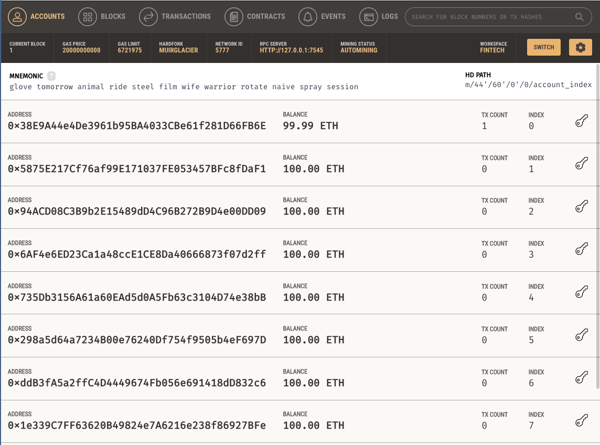
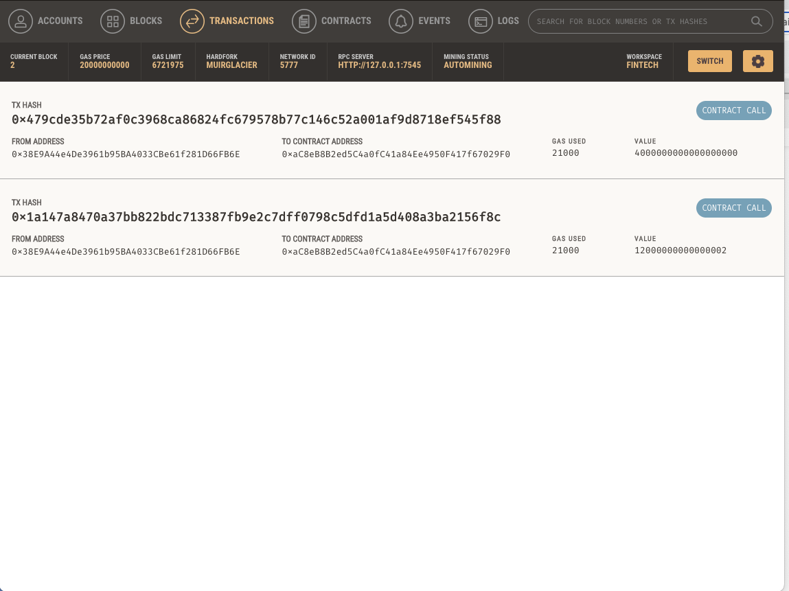

# Challenge 19 | Peter Lieberman | FinTech Finder

FinTech Finder is an interactive web application hosted on Streamlit that people can use to find fintech professionals from among a list of candidates, hire them, and pay them. 


## Technologies

```python
The program uses web3, dataclasses, typing, os, streamlit, and sevaral custom built functions. 
```

---

## Usage

The application takes two user inputs. The users selects a candidate and the number of hours to hire them for. It returns the candidates hourly rate and Ethereum address. If the user decides to hire the candidate, ETH can be sent directly to them. A record of the transactions appears in Ganache.

---

## Ganache Log





---

## License

MIT License
